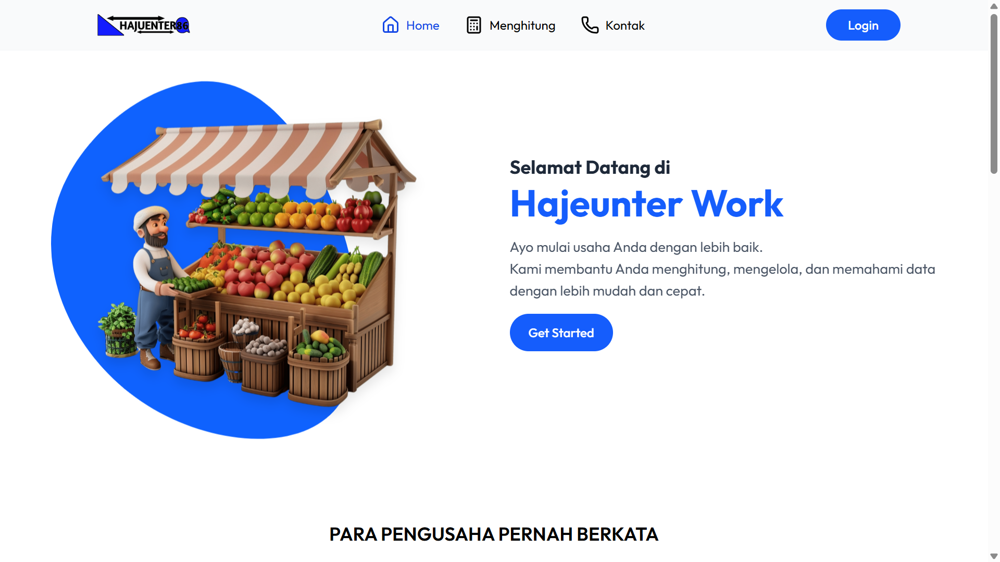
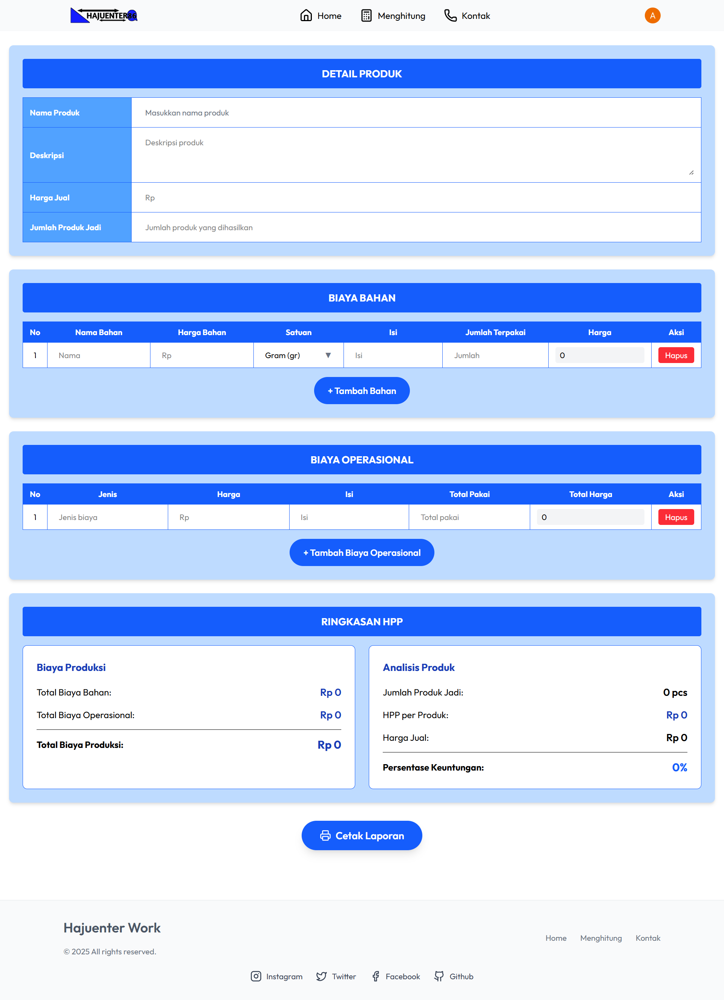

# 🧾 Hajuenter Usaha

<div align="center">
  <h3>Platform Pengelolaan Biaya & Estimasi Usaha Modern</h3>
  <p>
    <strong>Hajuenter Usaha</strong> adalah platform cerdas yang dirancang untuk membantu pelaku usaha kecil dan menengah dalam menghitung biaya produksi secara akurat. Dengan fitur-fitur lengkap seperti input bahan baku, biaya operasional, hingga perhitungan HPP (Harga Pokok Produksi) dan estimasi keuntungan, Anda dapat mengelola usaha secara efisien dan profesional.
  </p>
</div>

---

## ✨ Fitur Unggulan

### 📦 **Manajemen Bahan & Biaya Produksi**

- **Tambah Bahan Baku**: Input berbagai jenis bahan dengan harga dan jumlah
- **Biaya Produksi & Operasional**: Catat biaya tenaga kerja, listrik, sewa, dan lainnya
- **Otomatis Hitung Total Biaya Produksi**
- **Otomatis Hitung Total Biaya Operasional**

### 🧮 **Hitung HPP dan Estimasi Keuntungan**

- **Harga Pokok Produksi per Produk (HPP)**: Hitung secara otomatis berdasarkan input bahan dan biaya
- **Input Harga Jual**: Masukkan harga jual produk Anda
- **Persentase Keuntungan**: Lihat margin laba dari harga jual vs HPP
- **Estimasi Jumlah Produk Jadi**: Tentukan output produksi berdasarkan bahan

### 📑 **Laporan Lengkap & Cetak Excel**

- **Laporan HPP**: Tampilkan dan cetak hasil perhitungan HPP
- **Laporan Keuntungan & Kerugian**: Rangkuman estimasi laba/rugi
- **Cetak dalam Format PDF**: Siap untuk dokumentasi atau laporan usaha

### 📱 **Tampilan Modern & Mudah Digunakan**

- **Responsive Design**: Akses dari desktop, tablet, hingga mobile
- **UI Sederhana dan Intuitif**: Untuk semua level pengguna
- **Akses Cepat ke Fitur-Fitur Utama**

---

## 🖼️ Tampilan Website

<div align="center">
🏠 Halaman Utama

<p><em>Tampilan homepage</em></p>

---

✍️ Perhitungan HPP


<p><em>Panel perhitungan dan cetak laporan</em></p>
</div>

---

## 🛠️ Stack Teknologi

### **Frontend**

- ⚛️ **React.js** – Library JavaScript untuk membangun antarmuka pengguna
- ⚡ **Vite** – Build tool modern untuk development yang cepat
- 🎨 **Tailwind CSS** – Styling responsif dan menarik
- 🔐 **Clerk** – Autentikasi modern (login, register, session) berbasis komponen React

## 🔧 Pengembangan Lanjutan

### **Struktur Folder**

```
usaha/
├── client/
│   ├── src/
│   ├── public/
│   └── package.json
│   └── .env
└── README.md
```

## 🚀 Panduan Instalasi

### **Prasyarat**

- Node.js (versi v22.16.0 atau lebih baru)
- NPM (versi 10.9.2 atau lebih baru)
- Git

### **1. Clone Repository**

```bash
git clone https://github.com/hajuenter/usaha_hpp_app.git
cd usaha
```

### **2. Setup**

```bash
# Masuk ke direktori client
cd client

# Install dependencies
npm install

# Jalankan server development
npm run dev
```

### **3. Konfigurasi Environment Variables**

#### **File `.env` untuk folder `client`**

```env
# CLERK CONFIGURATION
VITE_CLERK_PUBLISHABLE_KEY=your_clerk_key
```

### **4. Menjalankan Aplikasi**

Setelah server berjalan:

- **Frontend**: `http://localhost:5173`

---

## 🤝 Kontribusi

Kami sangat mengapresiasi kontribusi dari komunitas! Berikut cara berkontribusi:

1. **Fork** repository ini
2. **Buat branch** untuk fitur baru: `git checkout -b fitur-awesome`
3. **Commit** perubahan: `git commit -m 'Menambahkan fitur awesome'`
4. **Push** ke branch: `git push origin fitur-awesome`
5. **Buat Pull Request** dengan deskripsi yang jelas

### **Panduan Kontribusi**

- Ikuti konvensi kode yang sudah ada
- Tambahkan tests untuk fitur baru
- Update dokumentasi jika diperlukan
- Gunakan commit message yang deskriptif

---

## 📞 Dukungan & Kontak

- **Email**: bahrulahmad1945@gmail.com
- **GitHub Issues**: [Laporkan Bug](https://github.com/hajuenter/usaha_hpp_app/issues)
- **Dokumentasi**: [Wiki Project](https://github.com/hajuenter/usaha_hpp_app/wiki)

---

## 📄 Lisensi

Proyek ini dilisensikan di bawah **MIT License**. Silakan gunakan, modifikasi, dan distribusikan sesuai kebutuhan Anda.

```
MIT License

Copyright (c) 2025 Hajuenter

Permission is hereby granted, free of charge, to any person obtaining a copy
of this software and associated documentation files (the "Software"), to deal
in the Software without restriction, including without limitation the rights
to use, copy, modify, merge, publish, distribute, sublicense, and/or sell
copies of the Software.
```

---

<div align="center">
  <p>
    <strong>Dibuat dengan oleh <a href="https://github.com/hajuenter">Hajuenter</a></strong>
  </p>
  <p>
    <em>Mengubah cara kita usaha dengan lebih profesional</em>
  </p>
</div>
